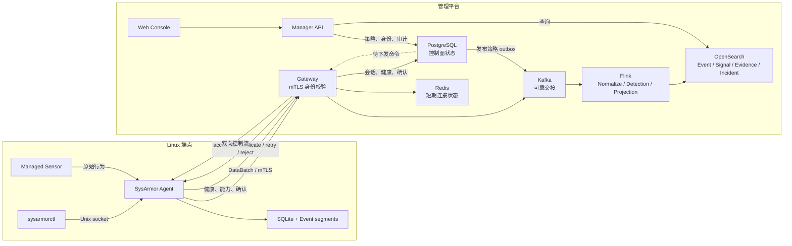
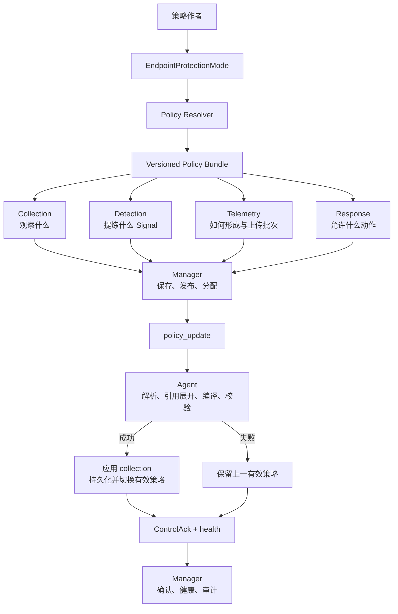
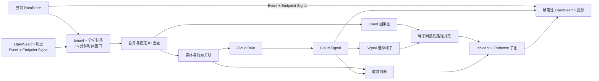
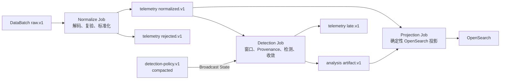

# SysArmor 系统架构

本文解释 SysArmor 的 Agent、控制平面、数据平面和云侧分析如何协作。核心对象见[安全数据模型](concepts/security-data-model.md)，设计动机见[设计原则](design-principles.md)，具体字段和接口分别以[配置参考](reference/configuration.md)与 [API 参考](reference/api.md)为准。

## 架构目标

SysArmor 面向持续变化的主机攻防，而不是一次性的日志收集。系统需要同时保持三项性质：端点在离线时仍能采集和检测；控制平面可以统一调整 collection、detection、telemetry、response；云侧可以在租户和分析作用域内关联更长时间窗口的数据。



这条链路由四个边界组成：Agent 负责端点自治；Gateway 和 Kafka 负责可靠接入；Flink 负责流式分析；Manager 负责身份、策略、查询和操作流程。云侧增强 Agent，但不替代本地运行时。

## 安全数据模型

SysArmor 的生产数据对象及 Signal 的 Stage、DetectorKind、Where 三个正交维度统一定义在[安全数据模型](concepts/security-data-model.md)。本页只说明这些对象如何经过系统组件。

Agent 产生 Event 和 Endpoint Signal；Flink 在 tenant、分析作用域和时间窗口内读取规范化流数据，产生 Cloud Signal、Evidence 子图和 Incident。Incident 是可重复计算的安全分析报告，不是人工工单。调查方法见[调查指南](guides/investigation.md)。

## Agent 端点自治

### 运行模式

安装后，Agent 立即以 **standalone** 模式运行：创建本地设备身份、管理 sensor、规范化 Event、执行端点检测、保存有界数据并产生 Endpoint Signal，不连接 Manager 或 Gateway。

注册操作会原子地切换到 **managed** 模式。原有采集和检测路径保持不变，只增加经身份认证的数据上传和控制通道。取消注册会移除云侧凭据并回到 standalone，不应停止本地采集。

### 本地职责

Agent 负责：

- 管理 sensor 生命周期，将有效策略中的 collection intent 编译为 sensor 能力；
- 规范化 Event，执行低延迟检测并生成 Endpoint Signal；
- 以唯一的 `ProcessProfile` 聚合进程行为，并在 Profile 淘汰后保留有界身份锚点；
- 原子应用统一端点策略，并持久化有效版本；
- 在网络中断时继续工作，恢复后从确认的 checkpoint 续传；
- 通过本地 Unix socket 提供健康、策略、查询、内容和注册操作；
- 在授权范围内执行响应并返回确认。

`sysarmorctl` 只通过 `/run/sysarmor/agent/control.sock` 操作 Agent，不直接读取 SQLite 或事件段文件。运行路径的完整契约见 [Configuration Reference](reference/configuration.md)。

### ProcessProfile 与端侧 Learning

Agent 只维护一份运行时 `ProcessProfile` 集合。进程身份优先使用 sensor exec ID，缺失时使用 host、PID 和启动时间生成稳定 ID；父身份和 lineage 随 Profile 保留，PID 复用不会覆盖旧进程身份。Profile 按 Active、Exited、Retained 三态流转：退出后保留完整特征供最终推理，经过 grace period 后压缩为只保留身份的 Retained Profile，再在 retained TTL 后过期；因容量被淘汰的 Profile 另行保留有界身份锚点。回收由 sensor 的 boot monotonic 事件时间惰性触发；即使端点长期静默，Profile 总数和身份锚点仍由硬容量限制保证内存有界。

默认每个运行时最多保留 `sensor.process_cache_size` 个 Profile、两倍数量的身份锚点；单个 Profile 最多保留 32 个文件、16 个网络地址和 16 个 Event 引用。容量压力优先淘汰 Retained、再淘汰 Exited、最后淘汰最旧 Active，并通过 Learning health 暴露压缩、过期、容量淘汰、特征淘汰和身份缺口指标。

Learning Model 在离线训练、端侧推理的边界内运行：

1. 从 ProcessProfile 的命令、文件和网络地址提取 Unicode 字母数字 token；
2. 用 FastText token 与子词向量形成句向量，并用训练集 IDF 对资源特征加权；
3. 以 VAE 编码器的 mean 分支做确定性重建，计算重建均方误差；
4. 用离线 DBSCAN 得到的进程稳定性值（SV）修正误差，计算 `score = log(MSE / SV)`；
5. 当 `score >= threshold` 时产生 Endpoint Model Candidate，并附带模型 provenance、实体和 Event 引用。

训练工具使用端点自采 Event 重建同一 ProcessProfile，并要求训练集与独立校准集不存在 Event 或 Profile 身份重叠。Python 训练侧和 Go Agent 侧对分词、子词、`float32` 累加、VAE mean 推理、SV 修正和阈值比较使用同一合同。Agent 不在本地构建完整攻击图；Worker 将 Event 规范化为 `ProvenanceEdge`，再连接 Endpoint Candidate，并负责后续 Evidence 与 Conclusion 分析。

### 有界持久化

SQLite 保存设备身份、注册状态、有效策略、Signal、事件段元数据和上传 checkpoint；高吞吐 Event 写入有界追加段。容量限制和最小剩余空间防止本地状态无限增长。

默认打包配置目前使用 10 GiB 本地状态上限、2 GiB 最小文件系统剩余空间、64 MiB 事件段和 100,000 条 Signal 保留上限。这些是可配置默认值，不是架构常量。

空间回收先清理超量 Signal，再优先删除已经上传的旧密封段；如果压力迫使 Agent 丢弃尚未上传的数据，必须增加 storage-drop 计数，不能把丢失报告成成功上传。启动时会校验 SQLite 与事件段：不完整的活动段尾部可截断到最后一条完整记录，非法头、非法记录、密封段损坏或多个活动段会显式导致启动失败。

## 统一控制平面

端点策略由同一版本中的四个部分构成。`EndpointProtectionMode` 是 Manager 的策略管理维度，不是第五层策略：



Manager 保存的 Bundle 必须明确选择 `rule-only`、`learning-only` 或 `hybrid`，并完整包含四层。Resolver 校验检测能力与 Mode 一致，为 Learning 补齐因果采集需求，再生成下发文档。Mode 只用于来源、审计和解析，不会下发给 Agent。Agent 只解析四层 Endpoint Policy，并依据 Detection 中的版本化模型引用启用 Learning。

策略更新必须先解析、校验和编译，成功后才能替换有效版本；有效策略会持久化，重启不会静默退回安装包默认值。Manager 负责策略分配和下发，Agent 报告能力、健康状态与实际有效版本。具体操作与安全约束见[策略指南](guides/policy.md)。

本地 Unix API 还支持内容查询与应用、Event 查询、debug profile 和策略操作。远程 `Connect` 控制通道负责策略与内容下发、response、Evidence pullback，以及 health/capability 状态交互；当前不提供远程 Event 查询或 debug profile。端点私钥在本机生成，注册时提交 CSR；签发证书使用以下 URI 身份：

```text
spiffe://sysarmor.local/tenant/<tenant_id>/agent/<agent_id>
```

Gateway 会将该身份与每个上报的 tenant ID 和 Agent ID 交叉校验。Manager 的操作员身份来自已验证的短期 RS256 JWT；调用者自报的身份 Header 不能建立身份。Web Console 的服务端 BFF 签发 Manager JWT，浏览器不直接接触 JWT 或 Manager 内部地址。

## 数据平面与可靠性

完成注册的 Agent 只上传有效策略产生的 Event 和 Signal。`rule-only` 只采集规则所需事实；`learning-only` 和 `hybrid` 的已解析 Bundle 包含 `process.exec`、`process.exit`、`process.fork`、`file.write` 和 `network.connect` 因果骨架。Agent 不再为所有策略偷偷扩大采集面。注册不会创建第二条采集路径，也不会自动上传注册前的历史数据；历史上传必须显式请求。

Agent 以批次发送数据，Gateway 返回 accepted、duplicate、retryable 或 terminally invalid。只有 accepted 或 duplicate 确认可以推进本地 checkpoint。Gateway 完成身份和批次校验后，将数据交给 Kafka；Worker 在完成必需投影后才提交 Kafka offset。

Endpoint Model Candidate 与当前触发 Event 是 DataBatch 内的强引用：Candidate 必须有唯一 subject Process，至少一个 EventRef 必须在当前批次中解析，并且 Event 与 Candidate 的 subject StableID 一致。Agent、Gateway 和 Worker 共用该合同；历史上下文仍按弱引用处理，缺失时进入 gap/incomplete，而不是拒绝所有不完整历史。

永久非法输入只有在 dead-letter 记录可靠写入后才能提交。临时错误不提交并等待重试。派生文档使用确定性 ID，因此重复批次、Worker 重试和局部 Bulk 成功会重放到同一逻辑结果，而不是放大 Signal 或 Incident。

Learning health 公开 Candidate 的 `created`、`spooled`、`gateway_accepted_unique`、`gateway_duplicate_ack`、`contract_rejected` 和 `gateway_rejected` 计数。Worker 在 PostgreSQL `worker_signal_processing` 中按同一 `Signal.id` 记录 `correlated`、`projected` 或 `reference_rejected`，OpenSearch 保存最终投影。验收要求各阶段 Signal cohort 严格守恒；duplicate ACK 只表示幂等重试，不参与守恒。这些生产指标与本地 storage drop、观察 Ring Buffer eviction 分开，允许定位缺口发生在观察、端侧持久化、Gateway、Worker 关联还是投影。

## 云侧分析

Worker 当前按 `tenant_id` 和分析标签限定作用域。分析标签从 `case_type`、`scenario`、`workload` 中选择；每个受影响作用域合并当前批次与 OpenSearch 中 15 分钟历史窗口内的 Event 和 Endpoint Signal，再根据有效检测策略重新计算 Cloud Signal 和 Incident。



Worker 先把 Event 规范化为有方向的 `ProvenanceEdge`，再构建进程、文件和 socket provenance 图：进程创建从父进程指向子进程，读操作从对象指向进程，写和发送操作从进程指向对象，每条边聚合对应的 `event_refs`；`process.exit` 只结束生命周期，不生成图边。合法 root process 即使没有父边也必须保留为图节点。Signal 只提供 Evidence 种子，不产生或补造 ProvenanceEdge。父身份缺失时图中保留明确的 gap 节点，并将相邻边标记为 incomplete。当前 Evidence 是最多 32 个种子在最多 100,000 条窗口 Event 上的种子间最短路径并集，不是完整 Steiner Tree，也不等于最可能攻击路径。Incident 保存贡献 Signal、Event 支撑的 Evidence、收敛轨迹和稳定分析标识；Model Candidate 不会单独晋升为 Incident，因此真实 managed 图与结论 recall 由 `hybrid` 路径验收。候选攻击路径排序、攻击阶段推理和自然语言根因解释仍是目标能力。

### Flink 流式检测平面

云侧分析运行在 Apache Flink 集群中，不保留 Go Worker 双跑、fallback 或兼容 facade。

目标架构划分四个互不越界的平面：

| 平面 | 组件 | 责任 |
|---|---|---|
| 控制平面 | Go Manager、PostgreSQL | Tenant、Agent、Enrollment、Policy、Response 和 Audit |
| 数据接入平面 | Gateway、Kafka | 身份校验、DataBatch 接收、可靠交接和有界重放 |
| 流式检测平面 | Flink JobManager、TaskManager、PyFlink Job | 标准化、有状态检测、Evidence 和 Incident 收敛 |
| 查询平面 | OpenSearch | Event、Signal、Evidence 和 Incident 查询投影 |

PostgreSQL 只保存 Manager 控制面状态。Flink Job 的镜像、配置、依赖和运行时均不得包含 PostgreSQL 驱动或 DSN，也不得通过 Manager API 回写逐 Event、逐 Signal、逐批次或检测窗口状态。Kafka 是可重放的流式日志；Flink checkpoint/savepoint 是有界计算状态；OpenSearch 是可重建查询投影。三者都不能被替换为 PostgreSQL Worker 账本。

Flink 集群是通用运行平台，SysArmor 流式任务是独立发布单元。首个生产拓扑由三个 Job 组成：



三个 Job 的边界如下：

1. **Normalize Job** 消费原始 DataBatch，复验 Protobuf、tenant、策略版本和 Candidate 当前触发 Event 强引用，生成具有确定性身份和 event time 的规范化记录。永久非法输入写入 rejection Topic；临时依赖错误不能被伪装成拒绝。
2. **Detection Job** 按 `tenant_id + analysis_scope` 分区，以 keyed state 保存有界 Event、ProvenanceEdge、Candidate seed、rarity 和 feature 状态。它使用 event-time watermark、timer 和显式淘汰策略产生 Cloud Signal、Evidence 和 Incident，不从 OpenSearch 回读历史，不查询 PostgreSQL。
3. **Projection Job** 消费规范化事实和分析产物，以确定性文档 ID 写入 OpenSearch。投影采用 at-least-once 交付和幂等覆盖；重复输入不能放大逻辑 Event、Signal、Evidence 或 Incident。

任务之间只使用版本化 Kafka 合同，不直接调用彼此，也不共享进程内状态。基线与实验 Detection Job 可以用独立 consumer group、checkpoint 路径和输出 Topic 消费同一规范化输入；实验 Job 不能写入生产 artifact Topic。首版只维护以上三类职责，不为每一种 Event、Signal 或算法创建独立 Topic。

Manager 使用 transactional outbox 在同一个 PostgreSQL 事务中保存已发布策略和待发布消息，再由控制面 relay 将不可变版本投递到 compacted Policy Topic；Kafka 确认后才能完成 outbox。该 outbox 是控制面 Policy 状态，不包含 Event、Signal 或 Worker 处理明细。Topic key 包含 tenant、Policy ID 和 version，历史版本至少保留到所有引用它的 DataBatch 超出 Kafka 最大重放窗口。Detection Job 通过 Broadcast State 使用精确版本；版本缺失时明确失败并停止越过该输入，不读取 PostgreSQL，也不使用默认策略。

Flink JVM Runtime 负责调度、反压、checkpoint、watermark、状态后端和故障恢复；Python Worker 只承载版本化合同映射与检测领域算子。Job 使用 PyFlink DataStream API，Python 依赖由 `uv` 管理。状态按稳定 key 增量更新，禁止在 JVM 与 Python 间反复传输完整租户图；经实测确认的热点算子才允许单独下沉为 Java Operator。

checkpoint 和 savepoint 只依赖 S3-compatible 接口，路径按稳定 Job ID 隔离。Compose/VM 首先使用 MinIO 作为默认实现；对象存储供应商不能进入 Job 代码。RustFS 等替代实现必须通过 checkpoint 创建、JobManager/TaskManager 重启恢复、并发 checkpoint、savepoint 升级、网络中断恢复和过期对象清理测试后，才能替换默认实现。

交付语义遵循以下不变量：

- Normalize 和 Detection 的 Kafka source offset 与 Kafka sink 输出由同一 Flink checkpoint 协调；失败从最后成功 checkpoint 重放。
- Projection 只有在 OpenSearch 请求成功后才能确认对应输入进度；局部成功通过确定性文档 ID 安全重放。
- checkpoint 只保存恢复所需的有界状态，不能充当永久安全数据仓库。
- 超出实时允许迟到范围的事实仍需投影，并进入明确的 late-data 流；不得静默丢弃或倒灌已经关闭的实时窗口。
- 生产健康通过 Flink/Kafka/OpenTelemetry 指标表达，包括输入、拒绝、迟到、投影、checkpoint、恢复、backpressure、watermark 和 state size；不得为观测指标建立逐 Signal PostgreSQL 表。

迁移完成必须同时满足：真实 JobManager 和 TaskManager 运行三个 Job；TaskManager 与 JobManager 故障后可从 checkpoint 恢复；managed medium 的 Rule 等价性、Candidate 引用、graph recall 和 conclusion recall 达到既定门槛；PostgreSQL 中不存在 Worker 专属表或安全数据；旧 `sysarmor-worker` 命令、Bootstrap、Application、Adapter、镜像、配置、测试 fixture 和部署入口全部删除。

## 平台组件与存储职责

| 组件或存储 | 责任 |
|---|---|
| Gateway | 验证 Agent 身份，接收数据，维护控制连接 |
| Kafka | 保存等待处理的 telemetry，提供可靠交接 |
| Flink | 标准化 telemetry、执行有状态关联、生成并投影派生数据 |
| Manager | 提供注册、策略、响应、查询和审计接口 |
| PostgreSQL | Agent、注册、制品、通道、策略、响应和审计等控制面状态 |
| OpenSearch | Event、Signal、Evidence 和可重复 Incident 报告 |
| Redis | Gateway 的短期连接与恢复状态 |

查询边界取决于运行范围：端点测试可以通过 Agent 本地流验证端点行为；包含 Manager 和 Gateway 的拓扑必须通过 Manager API 查询，并显式提供 tenant 上下文。内部数据库格式不是用户接口。

### Agent 分层与启动路径

Agent 的两个命令入口统一采用以下依赖方向：

```text
cmd -> bootstrap -> application + ports <- adapters
                         |
                         v
                       domain
```

`cmd/sysarmor-agent` 和 `cmd/sysarmor-content-sign` 只负责参数、进程信号和顶层退出码，并只
导入 Bootstrap。Bootstrap 校验配置，创建 SQLite、文件系统、Tetragon、Unix socket 和 gRPC
Adapter，将窄 Port 注入 Application Service，并通过 Runner 管理启动、停止和资源关闭顺序。
Application 负责内容、策略、事件管线、telemetry、注册、健康、响应和诊断用例；Domain 只
保存确定性模型、状态转换和算法。

YAML、Protobuf、SQLite schema、文件系统、操作系统和 sensor 类型只存在于 Adapter 边界。
已发布 SQLite schema 与 `legacy_mtls` 退管兼容性也只在该边界处理。生产路径不存在旧根包
转发 facade、聚合 Store 或 `AgentRuntime` 服务定位器。standalone 与 managed 复用同一采集
和检测管线，但保留独立的策略 authority 与传输语义；managed 失败时不会回退到 standalone
策略或凭据。

### 平台分层与启动路径

Manager、Gateway 和 Flink Job 的生产入口统一采用以下依赖方向：

```text
cmd -> bootstrap -> application + ports <- adapters
                         |
                         v
                       domain
```

`cmd` 只解析参数、建立 signal context、调用 Bootstrap 并管理顶层退出码。Bootstrap 创建
PostgreSQL、Kafka、OpenSearch 等技术资源并注入端口；Application 编排用例与事务语义；
Domain 只包含确定性模型和算法。Protobuf、SQL、Kafka 和 OpenSearch 类型不得进入 Domain，
Application 也不直接导入技术 Adapter。

Normalize Job 将 wire batch 校验并映射为版本化 telemetry；Detection Job 负责 policy
Broadcast State、watermark、Provenance、rarity、分析和 artifact；Projection Job 负责稳定
文档 ID 的 OpenSearch 幂等投影。重复输入通过 Kafka checkpoint 和稳定 ID 重放安全处理；永久
错误进入对应 DLQ，临时错误保持可重试。

Manager 的控制面持久化仅支持 PostgreSQL。Flink Job 不访问 PostgreSQL；缺失 Policy 版本
会明确失败，不回退到内存默认策略。

## 失败边界

系统遵循以下不变量：

- 云侧不可用不能使本地采集和检测停止；
- 未持久化的本地写入不能报告成功；
- 未获可靠确认的上传不能推进 checkpoint；
- 未完成必需投影的 Flink Job 不能确认对应输入进度；
- 数据丢弃、解析错误、队列溢出和策略失败必须进入健康状态或审计；
- 关联不能跨 tenant 或既定分析作用域；
- Agentic 建议不能绕过策略校验、作用域、资源预算、审批和审计。

## 能力边界

| 状态 | 能力 |
|---|---|
| 当前已具备 | standalone/managed 切换、按保护模式解析采集需求、ProcessProfile 有界身份连续性、本地检测与有界存储、统一端点策略、注册与 mTLS、可靠批次上传、15 分钟历史关联、Endpoint/Cloud Signal、Event provenance Evidence、稳定 Incident 投影 |
| 工程基础已具备但仍需产品化 | 完整 Incident 调查体验、Evidence 到原始材料的连续回溯、策略和资源预算的统一可视化 |
| 目标能力 | 风险触发的临时加深采集与自动恢复、候选路径排序、攻击阶段推理、自然语言根因解释、受约束的 Agentic 策略调优 |

“目标能力”描述架构方向，不应在测试报告、发布说明或商业材料中作为当前能力陈述。

## 继续阅读

- [安全数据模型](concepts/security-data-model.md)：Event、Signal、Evidence 和 Incident 的精确定义。
- [设计原则](design-principles.md)：为什么采用动态博弈、效能平衡和端云协同。
- [策略指南](guides/policy.md)：如何理解和调整四层统一策略。
- [调查指南](guides/investigation.md)：如何解释 Event、Signal、Evidence 和 Incident。
- [部署指南](operations/deployment.md)：如何部署 Agent 和平台。
- [API Reference](reference/api.md)：控制面、数据面和查询接口的精确契约。
