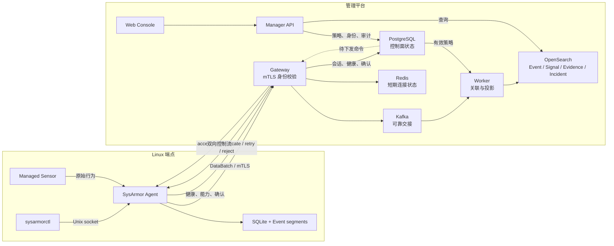
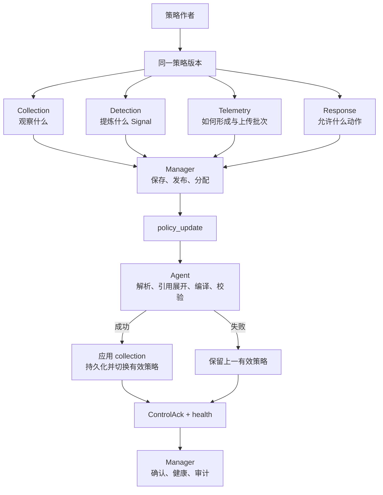
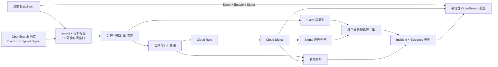

# SysArmor 系统架构

本文解释 SysArmor 的 Agent、控制平面、数据平面和云侧分析如何协作。核心对象见[安全数据模型](concepts/security-data-model.md)，设计动机见[设计原则](design-principles.md)，具体字段和接口分别以[配置参考](reference/configuration.md)与 [API 参考](reference/api.md)为准。

## 架构目标

SysArmor 面向持续变化的主机攻防，而不是一次性的日志收集。系统需要同时保持三项性质：端点在离线时仍能采集和检测；控制平面可以统一调整 collection、detection、telemetry、response；云侧可以在租户和分析作用域内关联更长时间窗口的数据。



这条链路由三个边界组成：Agent 负责端点自治；Gateway、Kafka 和 Worker 负责可靠接入与分析；Manager 负责身份、策略、查询和操作流程。云侧增强 Agent，但不替代本地运行时。

## 安全数据模型

SysArmor 的生产数据对象及 Signal 的 Stage、DetectorKind、Where 三个正交维度统一定义在[安全数据模型](concepts/security-data-model.md)。本页只说明这些对象如何经过系统组件。

Agent 产生 Event 和 Endpoint Signal；Worker 在 tenant、分析作用域和时间窗口内读取当前与历史数据，产生 Cloud Signal、Evidence 子图和 Incident。Incident 是可重复计算的安全分析报告，不是人工工单。调查方法见[调查指南](guides/investigation.md)。

## Agent 端点自治

### 运行模式

安装后，Agent 立即以 **standalone** 模式运行：创建本地设备身份、管理 sensor、规范化 Event、执行端点检测、保存有界数据并产生 Endpoint Signal，不连接 Manager 或 Gateway。

注册操作会原子地切换到 **managed** 模式。原有采集和检测路径保持不变，只增加经身份认证的数据上传和控制通道。取消注册会移除云侧凭据并回到 standalone，不应停止本地采集。

### 本地职责

Agent 负责：

- 管理 sensor 生命周期，将 collection intent 编译为 sensor 能力，并常开最小因果基线；
- 规范化 Event，执行低延迟检测并生成 Endpoint Signal；
- 以唯一的 `ProcessProfile` 聚合进程行为，并在 Profile 淘汰后保留有界身份锚点；
- 原子应用统一端点策略，并持久化有效版本；
- 在网络中断时继续工作，恢复后从确认的 checkpoint 续传；
- 通过本地 Unix socket 提供健康、策略、查询、内容和注册操作；
- 在授权范围内执行响应并返回确认。

`sysarmorctl` 只通过 `/run/sysarmor/agent/control.sock` 操作 Agent，不直接读取 SQLite 或事件段文件。运行路径的完整契约见 [Configuration Reference](reference/configuration.md)。

### 有界持久化

SQLite 保存设备身份、注册状态、有效策略、Signal、事件段元数据和上传 checkpoint；高吞吐 Event 写入有界追加段。容量限制和最小剩余空间防止本地状态无限增长。

默认打包配置目前使用 10 GiB 本地状态上限、2 GiB 最小文件系统剩余空间、64 MiB 事件段和 100,000 条 Signal 保留上限。这些是可配置默认值，不是架构常量。

空间回收先清理超量 Signal，再优先删除已经上传的旧密封段；如果压力迫使 Agent 丢弃尚未上传的数据，必须增加 storage-drop 计数，不能把丢失报告成成功上传。启动时会校验 SQLite 与事件段：不完整的活动段尾部可截断到最后一条完整记录，非法头、非法记录、密封段损坏或多个活动段会显式导致启动失败。

## 统一控制平面

端点策略由同一版本中的四个部分构成：



策略更新必须先解析、校验和编译，成功后才能替换有效版本；有效策略会持久化，重启不会静默退回安装包默认值。Manager 负责策略分配和下发，Agent 报告能力、健康状态与实际有效版本。具体操作与安全约束见[策略指南](guides/policy.md)。

本地 Unix API 还支持内容查询与应用、Event 查询、debug profile 和策略操作。远程 `Connect` 控制通道负责策略与内容下发、response、Evidence pullback，以及 health/capability 状态交互；当前不提供远程 Event 查询或 debug profile。端点私钥在本机生成，注册时提交 CSR；签发证书使用以下 URI 身份：

```text
spiffe://sysarmor.local/tenant/<tenant_id>/agent/<agent_id>
```

Gateway 会将该身份与每个上报的 tenant ID 和 Agent ID 交叉校验。Manager 的操作员身份来自已验证的短期 RS256 JWT；调用者自报的身份 Header 不能建立身份。Web Console 的服务端 BFF 签发 Manager JWT，浏览器不直接接触 JWT 或 Manager 内部地址。

## 数据平面与可靠性

完成注册的 Agent 只上传有效策略产生的 Event 和 Signal。有效 collection intent 始终包含 `process.exec`、`process.exit`、`process.fork`、`file.write` 和 `network.connect` 最小因果基线，普通 selector 可以增加采集但不能关闭或缩窄基线。注册不会创建第二条采集路径，也不会自动上传注册前的历史数据；历史上传必须显式请求。

Agent 以批次发送数据，Gateway 返回 accepted、duplicate、retryable 或 terminally invalid。只有 accepted 或 duplicate 确认可以推进本地 checkpoint。Gateway 完成身份和批次校验后，将数据交给 Kafka；Worker 在完成必需投影后才提交 Kafka offset。

永久非法输入只有在 dead-letter 记录可靠写入后才能提交。临时错误不提交并等待重试。派生文档使用确定性 ID，因此重复批次、Worker 重试和局部 Bulk 成功会重放到同一逻辑结果，而不是放大 Signal 或 Incident。

## 云侧分析

Worker 当前按 `tenant_id` 和分析标签限定作用域。分析标签从 `case_type`、`scenario`、`workload` 中选择；每个受影响作用域合并当前批次与 OpenSearch 中 15 分钟历史窗口内的 Event 和 Endpoint Signal，再根据有效检测策略重新计算 Cloud Signal 和 Incident。



Worker 用 Event 构建进程、文件和 socket provenance 图，每条边保留 `event_refs`；Signal 只提供 Evidence 种子，不产生或补造因果边。`identity_status=unavailable` 时图中保留明确的父身份 gap，并将相邻边标记为 incomplete。当前 Evidence 是最多 32 个种子在最多 100,000 条窗口 Event 上的种子间最短路径并集，不是完整 Steiner Tree，也不等于最可能攻击路径。Incident 保存贡献 Signal、Event 支撑的 Evidence、收敛轨迹和稳定分析标识；候选攻击路径排序、攻击阶段推理和自然语言根因解释仍是目标能力。

## 平台组件与存储职责

| 组件或存储 | 责任 |
|---|---|
| Gateway | 验证 Agent 身份，接收数据，维护控制连接 |
| Kafka | 保存等待处理的 telemetry，提供可靠交接 |
| Worker | 读取历史、执行关联、生成并投影派生数据 |
| Manager | 提供注册、策略、响应、查询和审计接口 |
| PostgreSQL | Agent、注册、制品、通道、策略、响应和审计等控制面状态 |
| OpenSearch | Event、Signal、Evidence 和可重复 Incident 报告 |
| Redis | Gateway 的短期连接与恢复状态 |

查询边界取决于运行范围：端点测试可以通过 Agent 本地流验证端点行为；包含 Manager 和 Gateway 的拓扑必须通过 Manager API 查询，并显式提供 tenant 上下文。内部数据库格式不是用户接口。

### Agent 分层与启动路径

Agent 的两个命令入口统一采用以下依赖方向：

```text
cmd -> bootstrap -> application + ports <- adapters
                         |
                         v
                       domain
```

`cmd/sysarmor-agent` 和 `cmd/sysarmor-content-sign` 只负责参数、进程信号和顶层退出码，并只
导入 Bootstrap。Bootstrap 校验配置，创建 SQLite、文件系统、Tetragon、Unix socket 和 gRPC
Adapter，将窄 Port 注入 Application Service，并通过 Runner 管理启动、停止和资源关闭顺序。
Application 负责内容、策略、事件管线、telemetry、注册、健康、响应和诊断用例；Domain 只
保存确定性模型、状态转换和算法。

YAML、Protobuf、SQLite schema、文件系统、操作系统和 sensor 类型只存在于 Adapter 边界。
已发布 SQLite schema 与 `legacy_mtls` 退管兼容性也只在该边界处理。生产路径不存在旧根包
转发 facade、聚合 Store 或 `AgentRuntime` 服务定位器。standalone 与 managed 复用同一采集
和检测管线，但保留独立的策略 authority 与传输语义；managed 失败时不会回退到 standalone
策略或凭据。

### 平台分层与启动路径

Manager、Gateway 和 Worker 的生产入口统一采用以下依赖方向：

```text
cmd -> bootstrap -> application + ports <- adapters
                         |
                         v
                       domain
```

`cmd` 只解析参数、建立 signal context、调用 Bootstrap 并管理顶层退出码。Bootstrap 创建
PostgreSQL、Kafka、OpenSearch 等技术资源并注入端口；Application 编排用例与事务语义；
Domain 只包含确定性模型和算法。Protobuf、SQL、Kafka 和 OpenSearch 类型不得进入 Domain，
Application 也不直接导入技术 Adapter。

Worker 的 Kafka inbound Adapter 将 wire batch 校验并映射为 Domain Event/Signal；
`ProcessBatch` Application Service 负责 claim、history、rarity、policy、分析、projection 和
commit/abandon；OpenSearch outbound Adapter 负责历史文档解码、稳定文档 ID 和批量投影。
重复批次视为成功，busy 或依赖失败保持可重试；永久错误仅在 DLQ 发布成功后提交 offset。

Manager 与 Worker 的生产持久化仅支持 PostgreSQL。缺失 DSN、迁移失败或数据库不可用时启动
失败，不回退到 memory/file Store。

## 失败边界

系统遵循以下不变量：

- 云侧不可用不能使本地采集和检测停止；
- 未持久化的本地写入不能报告成功；
- 未获可靠确认的上传不能推进 checkpoint；
- 未完成必需投影的 Worker 不能提交来源消息；
- 数据丢弃、解析错误、队列溢出和策略失败必须进入健康状态或审计；
- 关联不能跨 tenant 或既定分析作用域；
- Agentic 建议不能绕过策略校验、作用域、资源预算、审批和审计。

## 能力边界

| 状态 | 能力 |
|---|---|
| 当前已具备 | standalone/managed 切换、强制最小因果采集、ProcessProfile 有界身份连续性、本地检测与有界存储、统一端点策略、注册与 mTLS、可靠批次上传、15 分钟历史关联、Endpoint/Cloud Signal、Event provenance Evidence、稳定 Incident 投影 |
| 工程基础已具备但仍需产品化 | 完整 Incident 调查体验、Evidence 到原始材料的连续回溯、策略和资源预算的统一可视化 |
| 目标能力 | 风险触发的临时加深采集与自动恢复、候选路径排序、攻击阶段推理、自然语言根因解释、受约束的 Agentic 策略调优 |

“目标能力”描述架构方向，不应在测试报告、发布说明或商业材料中作为当前能力陈述。

## 继续阅读

- [安全数据模型](concepts/security-data-model.md)：Event、Signal、Evidence 和 Incident 的精确定义。
- [设计原则](design-principles.md)：为什么采用动态博弈、效能平衡和端云协同。
- [策略指南](guides/policy.md)：如何理解和调整四层统一策略。
- [调查指南](guides/investigation.md)：如何解释 Event、Signal、Evidence 和 Incident。
- [部署指南](operations/deployment.md)：如何部署 Agent 和平台。
- [API Reference](reference/api.md)：控制面、数据面和查询接口的精确契约。
